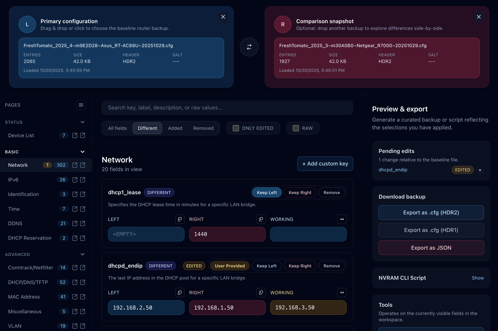

# 🍅 FreshTomato Config Compare & Edit

Interactive browser-based tool for inspecting, comparing, and editing FreshTomato router `.cfg` backups (NVRAM).
Runs fully offline and entirely in your browser, so your config files *never* leave your computer.
Includes a catalog of majority of Tomato's NVRAM settings with descriptions and parsers, and gives you superpowers when it’s time to understand and make changes to your Tomato routers.

## [Try It Now](https://niieani.github.io/freshtomato-config-compare-and-edit/)

[](https://niieani.github.io/freshtomato-config-compare-and-edit/)

## Use cases

- **Firmware jump with a clean slate.** The official docs recommend wiping NVRAM after a firmware upgrade. Load your “before” backup and a fresh “after reset” dump to selectively reapply only the good bits, or even just to preview your changes and re-apply them manually via the Web UI.
- **Hardware migration day.** Moving from one Tomato-capable router to another? Diff the old and new configs, grab the essentials, export a curated `.cfg` or an `nvram set/unset` script, and keep the lights on.
- **Sanity checks.** Preview every setting you’ve ever tweaked, compare a factory-reset baseline against your custom build, and make a backup right after the reset so you can always track what changed.

## Feature Highlights

- 🪄 **Drag, drop, done** Decode `.cfg` files instantly with per-page grouping, human-friendly labels, and description tooltips straight from the FreshTomato catalog.
- 🔍 **Signal over noise** Filter by added/removed/changed keys, spotlight pending edits, search across labels, values, and descriptions, and jump to any field via deep links.
- 🎛️ **Smart editors** Toggle booleans, pick from enums, adjust numbers with validation, or drop into raw mode for the weird stuff. Structured arrays/objects are represented with tidy editors.
- 🔄 **Left/Right/Custom control** Decide per field whether to keep the primary value, switch to the comparison snapshot, remove it entirely, or handcraft a custom override.
- 🧠 **Persistent workspace** Your last-loaded configs, theme choice, and selection decisions are saved locally so you can pick up where you left off.
- 📦 **Export** Generate fresh `.cfg` files with proper HDR1/HDR2 headers, or grab an `nvram set/unset` CLI script for SSH sessions. Want a diff report? Review it before you download.
- 🌙 **Dark mode** Toggle themes on the fly; the UI is tuned for both late-night remote sessions and daylight disaster recovery.
- 🧭 **Page navigation mirrors FreshTomato’s menu structure** Uncatalogued keys automatically grouped so nothing gets lost.

## Support the Project

Like how this smooths out your FreshTomato workflow? Consider sponsoring development via [GitHub Sponsors](https://github.com/sponsors/niieani).

## Development

Contributions welcome.

Requirements: [Bun](https://bun.sh/) ≥ 1.3 installed locally.

```bash
bun install
bun run dev   # open http://localhost:3000
```

Build time?

```bash
bun run build
```

Serve the production bundle:

```bash
bun run start
```

## License

MIT © 2025 Bazyli Brzóska — see [LICENSE](./LICENSE).
